## Qemu+openEuler+ROS2的安装与测试

System : Ubuntu 22.04

### QEMU源码获取

QEMU的源码可以直接通过github/gitlab进行获取：

[qemu/qemu: Official QEMU mirror](https://github.com/qemu/qemu)

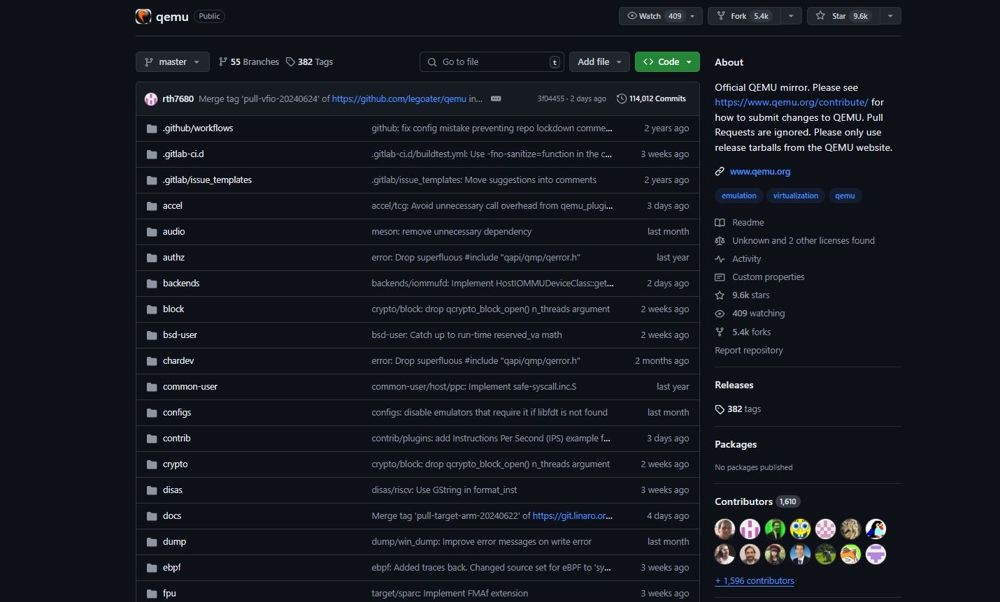

[QEMU / QEMU · GitLab](https://gitlab.com/qemu-project/qemu)


github获取-终端中输入：

```bash
git git@github.com:qemu/qemu.git
```

gitlab获取-终端中输入：

```bash
git git@gitlab.com:qemu-project/qemu.git
```

Git成功后，可以在运行路径下看到一个名称为qemu的文件夹

------


### QEMU编译

进入qemu文件夹：

```bash
cd ./qemu
```

在qemu文件夹下建立build文件夹，并进入：

```bash
mkdir build && cd build
```

在build文件夹下设置编译选项：

```bash
../configure --<编译选项>
```

具体的编译选项可以通过 configure --help 命令查看：

```bash
../configure --help | less
```


以下为编译选项示例：

```bash
../configure --target-list=aarch64-softmmu,aarch64-linux-user --enable-kvm --enable-spice --enable-guest-agent --enable-libusb --enable-usb-redir --enable-slirp --enable-sdl
```

- 指定编译CPU架构为aarch64
- 开启kvm支持
- 开启spice支持
- 开启Qemu Guest Agent
- 开启USB直通功能
- 开启USB重定向支持
- 开启Qemu 网络支持
- 开启SDL 接口

进行编译：

```bash
sudo make -j$(nproc)
sudo make install
```

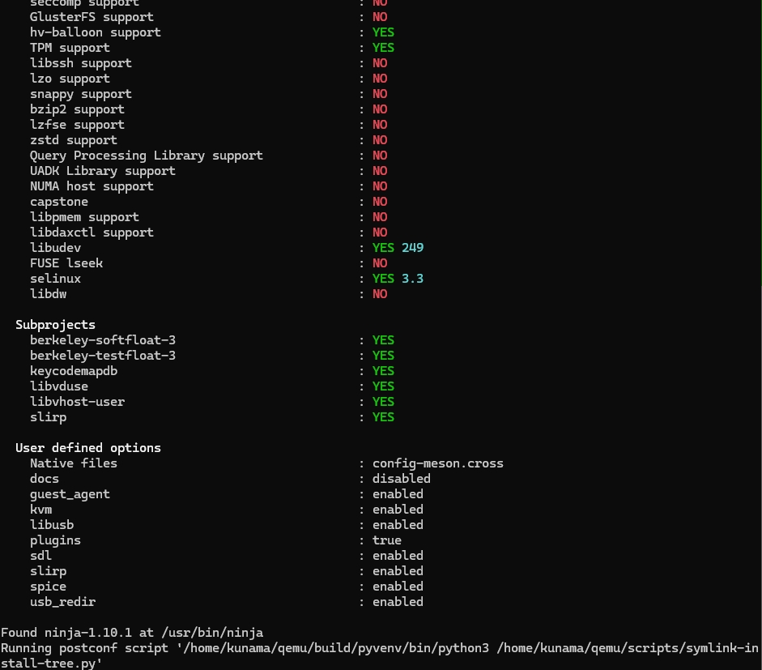

若缺少相关支持包，编译会产生错误：

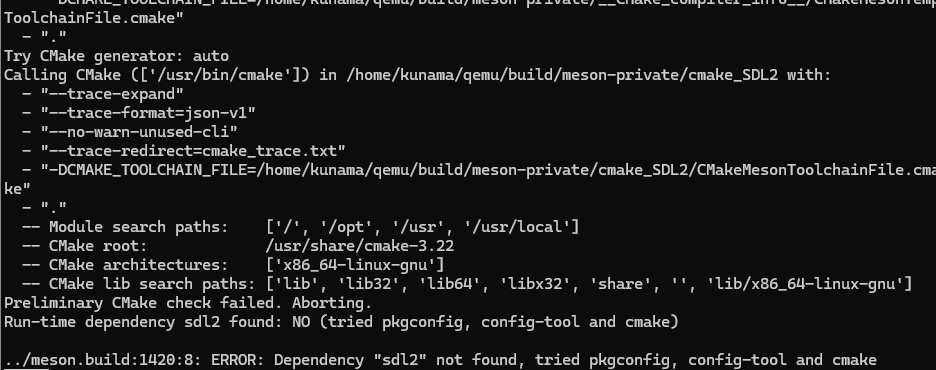

具体信息可以在menson-log.txt 中查看：

```bash
cat ./build/meson-logs/menson-log.txt
```

安装需要的支持包后重新编译即可

### Qemu结果验证

在终端中输入：

```bash
qemu-system-aarch64 --version
```

终端显示：


终端中输入：

```bash
qemu-aarch64 --version
```

终端显示：


至此安装结束~

------

### Qemu 安装 openEuler 安装

openEuler镜像下载地址：[repo.openeuler.org/openEuler-24.03-LTS/virtual_machine_img/](https://repo.openeuler.org/openEuler-24.03-LTS/virtual_machine_img/)

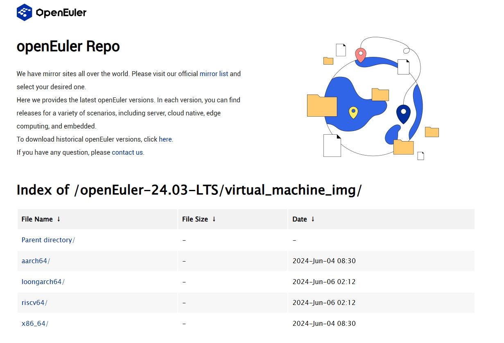

#### X86架构

下载x86的openEuler镜像：

```bash
wget -c https://repo.openeuler.org/openEuler-24.03-LTS/virtual_machine_img/x86_64/openEuler-24.03-LTS-x86_64.qcow2.xz
xz -d openEuler-24.03-LTS-x86_64.qcow2.xz
```

KVM访问授权：

```bash
sudo chod 666 /dev/kvm
```

启动虚拟机：

```bash
qemu-system-x86_64 \
  -name openEulerVM-x86_64 \
  -m 8G \
  -smp 4,sockets=2,cores=2,threads=1 \
  -cpu host \
  -drive file=openEuler-24.03-LTS-x86_64.qcow2,id=hd0,format=qcow2 \	
  -device e1000,netdev=net0 \
  -netdev user,id=net0,hostfwd=tcp::2222-:22 \
  -enable-kvm
```

openEuler-24.03-LTS-x86_64.qcow2应更换为具体的路径；

加入-nographic 选项可以用非图形界面运行

其他具体配置可以通过一下命令查看：

```bash
qemu-system-x86_64 --help | less
```

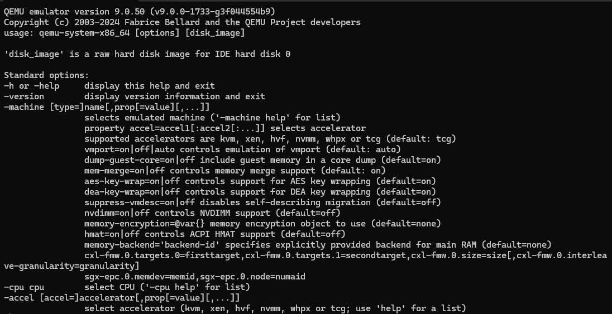

启动成功后进入以下界面：

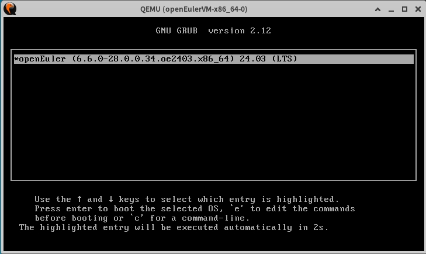

默认登录用户名为：root，密码：openEuler12#$，登陆后输入：

```bash
uname -a 
```

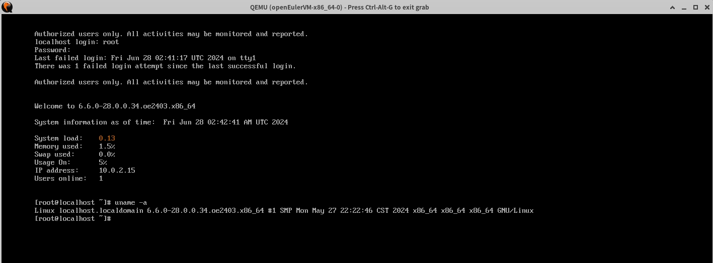

至此安装完成~

#### ARM架构

下载ARM架构的openEuler镜像：

```bash
wget -c https://repo.openeuler.org/openEuler-24.03-LTS/virtual_machine_img/aarch64/openEuler-24.03-LTS-aarch64.qcow2.xz
wget -c https://repo.openeuler.org/openEuler-24.03-LTS/OS/aarch64/images/pxeboot/initrd.img
wget -c https://repo.openeuler.org/openEuler-24.03-LTS/OS/aarch64/images/pxeboot/vmlinuz
```

解压压缩包：

```bash
xz -d openEuler-24.03-LTS-aarch64.qcow2.xz
```

启动虚拟机：

```bash
qemu-system-aarch64 \
  -machine virt -cpu cortex-a57 \
  -smp 8 -m 4G \
  -hda openEuler-24.03-LTS-aarch64.qcow2 \
  -kernel vmlinuz \
  -initrd initrd.img \
  -nic user,model=e1000,hostfwd=tcp::2222-:22 \
  -append 'root=/dev/vda2 console=ttyAMA0'
```

openEuler-24.03-LTS-aarch64.qcow2、vmlinuz、initrd.img需要更换到对应路径

建议使用非图像模式（图像模式可能会卡死，非图像启动如下：

```bash
qemu-system-aarch64 -nographic\
  -machine virt -cpu cortex-a57 \
  -smp 8 -m 4G \
  -hda openEuler-24.03-LTS-aarch64.qcow2 \
  -kernel vmlinuz \
  -initrd initrd.img \
  -nic user,model=e1000,hostfwd=tcp::2222-:22 \
  -append 'root=/dev/vda2 console=ttyAMA0'
```

其他具体配置可以通过一下命令查看：

```bash
qemu-system-aarch64 --help
```

启动后界面如下：

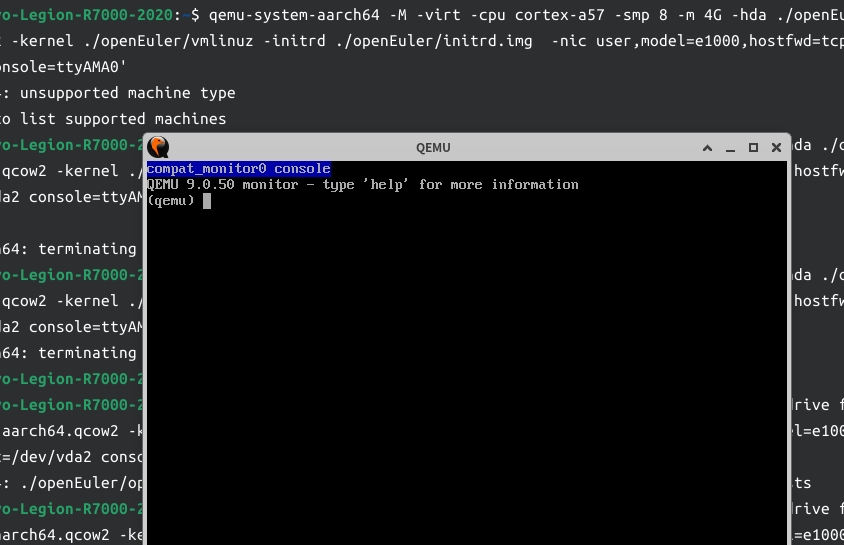

在打开的 qemu 的虚拟化窗口中，按下 Ctrl+Alt+2 切换到串口控制台后回车，如下图所示，并等待加载...........

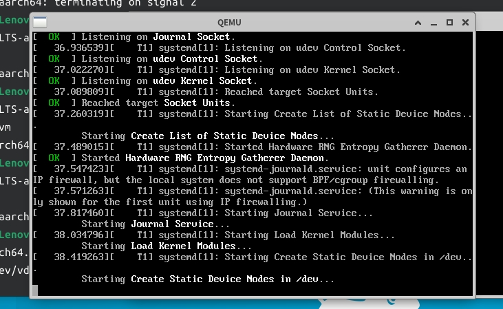

默认登录用户名为：root，密码：openEuler12#$，登陆后输入：

```bash
uname -a 
```


至此安装完成~

#### RISCV架构

下载RISCV架构的openEuler镜像以及相应的支持：

链接：[repo.openeuler.org/openEuler-24.03-LTS/virtual_machine_img/riscv64/](https://repo.openeuler.org/openEuler-24.03-LTS/virtual_machine_img/riscv64/)

```bash
wget -c https://repo.openeuler.org/openEuler-24.03-LTS/virtual_machine_img/riscv64/openEuler-24.03-LTS-riscv64.qcow2.xz
wget -c https://repo.openeuler.org/openEuler-24.03-LTS/OS/x86_64/images/pxeboot/initrd.img
wget -c https://repo.openeuler.org/openEuler-24.03-LTS/OS/x86_64/images/pxeboot/vmlinuz
wget -c https://repo.openeuler.org/openEuler-24.03-LTS/virtual_machine_img/riscv64/RISCV_VIRT_CODE.fd
wget -c https://repo.openeuler.org/openEuler-24.03-LTS/virtual_machine_img/riscv64/RISCV_VIRT_VARS.fd
```

解压镜像：

```
xz -d openEuler-24.03-LTS-riscv64.qcow2.xz
```

对于riscv架构的openEuler的启动可以通过官方提供的bash文件进行：

```bash
wget -c https://repo.openeuler.org/openEuler-24.03-LTS/virtual_machine_img/riscv64/start_vm.sh
```

start_vm.sh需要和openEuler的镜像和相关支持在同一路径之下，在相应路径输入：

```bash
bash start_vm.sh
```

输入后等待初始化后进入初始化界面，输入默认用户名和密码：

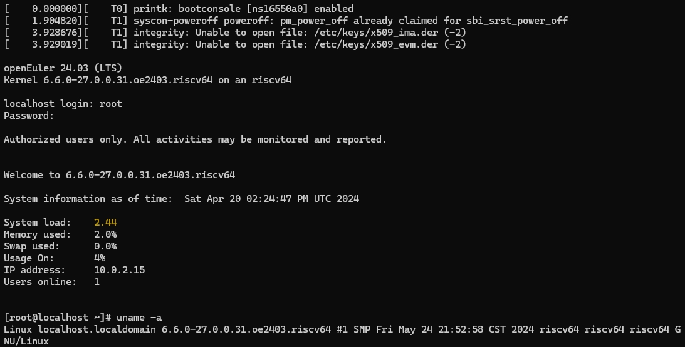

至此安装完成啦

------


### OpenEuler ROS2 Humble与测试

#### X86架构

启动虚拟机：

```bash
qemu-system-x86_64 \
  -name openEulerVM-x86_64 \
  -m 8G \
  -smp 4,sockets=2,cores=2,threads=1 \
  -cpu host \
  -drive file=openEuler-24.03-LTS-x86_64.qcow2,id=hd0,format=qcow2 \	
  -device e1000,netdev=net0 \
  -netdev user,id=net0,hostfwd=tcp::2222-:22 \
  -enable-kvm \
  -nographic	
```

输入默认的用户名和密码进行登录：

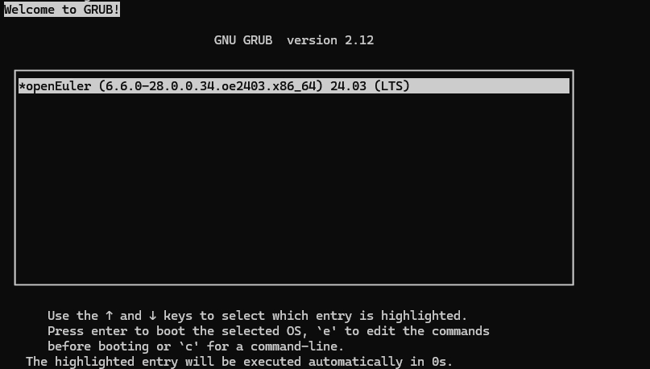

修改 `/etc/yum.repos.d/openEulerROS.repo` 文件为以下内容：

```
[openEulerROS-humble]
name=openEulerROS-humble
baseurl=http://121.36.84.172/dailybuild/EBS-openEuler-24.03-LTS/EBS-openEuler-24.03-LTS/EPOL/multi_version/ROS/humble/x86_64/
enabled=1
gpgcheck=0

[openEulerROS-humble-source]
name=openEulerROS-humble-source
baseurl=http://121.36.84.172/dailybuild/EBS-openEuler-24.03-LTS/EBS-openEuler-24.03-LTS/EPOL/multi_version/ROS/humble/source
enabled=1
gpgcheck=0
```

在安装过程中某些ROS软件依赖于`ros-humble-admittance-controller`包而该包会与`ros-humble-generate-parameter-library-example`产生冲突，需要暂时排除冲突的包

```bash
sudo dnf install "ros-humble-*" --exclude=ros-humble-admittance-controller --exclude=ros-humble-generate-parameter-library-example --skip-broken 
```

等待安装完成：

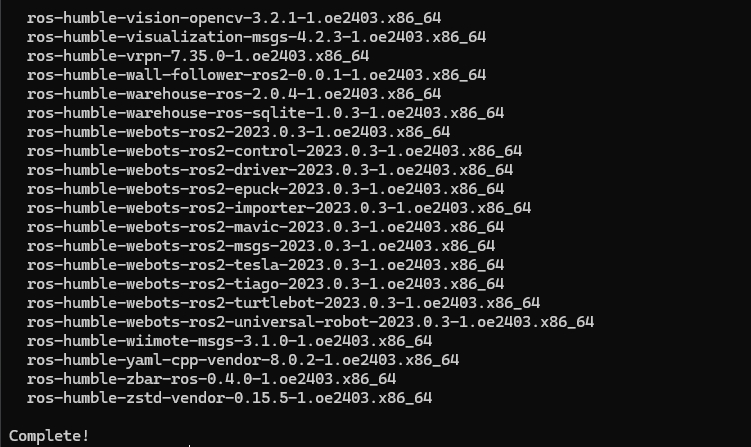

安装结束后需要进行环境配置，以便使用ROS2的命令：

- 获取并将源添加到shell启动脚本中

  ```bash
  source /opt/ros/humble/setup.bash				
  echo "source /opt/ros/humble/setup.bash" >> ~/.bashrc
  ```

  通过以下命令进行检查：

  ```bash
  printenv | grep -i ROS
  ```

  可以看到返回信息：

  


安装结束后，对ROS2 Humble进行用例测试：

- turtlesim（需要安装图像化桌面）:

  在桌面启动两个终端（交互需求），在两个终端中分别输入：

  ```bash
  ros2 run turtlesim turtlesim_node
  ```

  以及：

  ```bash
  ros2 run turtlesim turtle_teleop_key
  ```

  在输入`ros2 run turtlesim turtle_teleop_key`的窗口下，根据提示，通过按键控制乌龟的移动即可：

  

#### ARM架构

启动虚拟机：

```bash
qemu-system-aarch64 \
  -machine virt -cpu cortex-a57 \
  -smp 8 -m 4G \
  -hda openEuler-24.03-LTS-aarch64.qcow2 \
  -kernel vmlinuz \
  -initrd initrd.img \
  -nic user,model=e1000,hostfwd=tcp::2222-:22 \
  -append 'root=/dev/vda2 console=ttyAMA0'
  -nographic
```


#### RISCV架构

启动虚拟机,：

```bash
bash start_vm.sh
```


### 参考

[PLCT/report/qemu-install.md at main · Jiawei-afk/PLCT (github.com)](https://github.com/Jiawei-afk/PLCT/blob/main/report/qemu-install.md)

[Welcome to QEMU’s documentation! — QEMU documentation](https://www.qemu.org/docs/master/)
